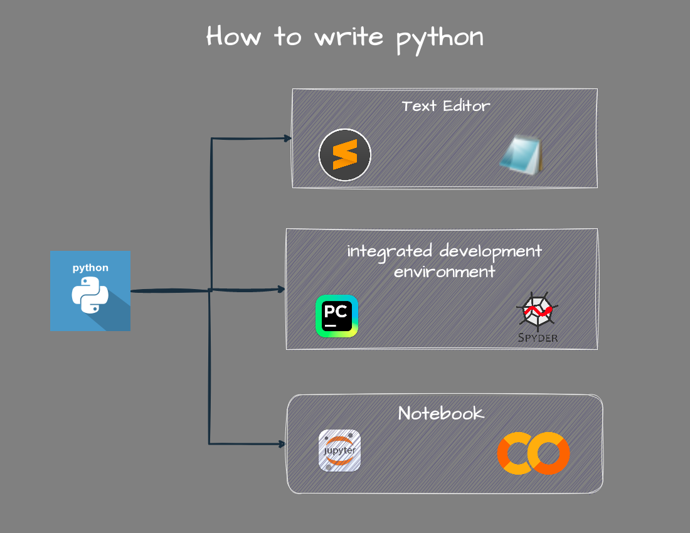
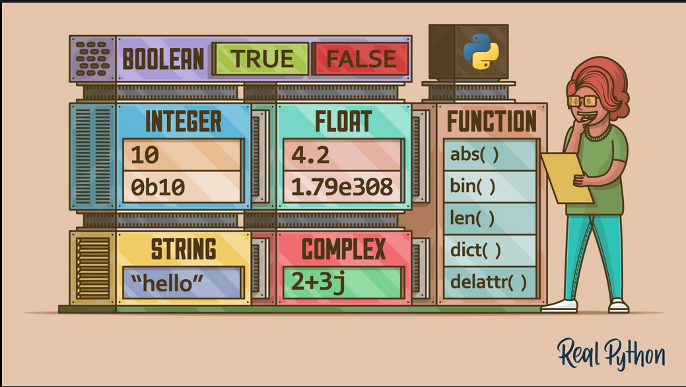

## Two main category of analysis tools

1. Auto-manage closed tools
	- Closed Source
	- Expensive
	- Limited Function
	- Easy to Learn
2. Programming language
	- Open Source
	- Free (or very cheap)
	- Extremely Powerful
	- Not easy to learn


## Why Python for Data Analysis?

- very simple to learn
- powerful libraries
- free and open source
- great community and grate docs


 ## How to write python 

 

 
 ## Translator

 - Compiler (Java, C, C++)
 	- Fast Runtime
 	- use for performance (eg. Gaming)
 - Interpreter (Java Script, Python)
 	- Slower than compiler

## Type of programming language

- Static Type
	- Declare data type before creating variable
	- `int a = 2` (JAVA)
- Dynamic Type
	- Not to declare data type
	- `a = 2`


```
program code ==> Translator ==> Machine code (binary code)
```

## Python Naming Conventions

- CamelCase
- snake_case

```
variable 	= lowercase (snake_case)
funciton	= lowercase (snake_case)
class		= UpperCaseCamelCase
constant	= Fully capitalized
```

- variable name should be meaningful.

**No space in variable name**
**Capitalized all latter of abbreviation** 

## Basic Data Type



- `print(type(variable))`