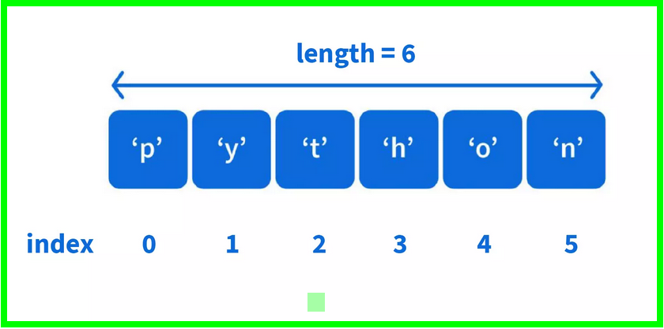

# Data Sturcture and Sequences

`List`, `Tuple`,`Dictionary`,`Set`

# The List Data Type

- Common use
- Different data type in one container
- use square 
- order structure (Indexing)
- mutable (changeable)
- Value inside the list are called `item`
	- item are separated with commas , `comma-delimited`


## Declare a list

- `student_list = ['Ko Ko', 30 , 'Alice' , 20, True]`

- `lst = list("python")`

## Indexing 




## Adding Elements (`Mutable`)

#### Append operation

`student_list.append("Bob")`

#### Insert operation (Using insert you can insert an element at a specific location in the list)

`student_list.insert(1, 'Leo')`

#### `extend()` Adding Multiple value to list

`student_list.extend([22,44,77,33,11])`


## Removing Element (`Mutable`)

#### `pop` operation

- remove and return an element at a particular index

`student_list.pop(1)`

#### `remove` operation

- First find the value and remove it 

`student_list.remove("Alice")`

## Getting length of List

`len(student_list)`


## Changing values in list with indexes

`student_list[1] = "index1"`


## List Concatenation 

```
student_list = ['Ko Ko', 30 , 'Alice' , 20, True]
test = [1,2,3,4]
student_list+test

```

## Sorting `sort()` 

```
lst = [6,7,4,8,3,1]
lst.sort()
```

#### Sorting multiple data type list

`student_list.sort(key=str)`


# Tuple Data Type

- immutable
- typed with parentheses instead brackets
- Tuples cannot modified, appended or remove

## Declare Tuple

- `lst= 1,2,3,'hello'`
- `lst = (1,2,3,'hello')`
- you can change list to tuple and tuple to list
	- list to tuple ==>`tup = tuple(student_list)` 
	- tuple to list ==> `lst = list(tup)`
## Indexing is same as List 

## The value of tuple cannot change

`tup[1]=99` ==> Return Type Error 

	

# The Dictionary Data Type

- key-value pair
- typed with braces `{}`
- unordered (unlike `list`)
- the first item in a list is list_name[0], but dictionary has no `first` item
- can't sliced like list 

`my_cat = {'size' : 'fat', 'color' : 'black', 'gender' : 'male'}`

## Access the value through their key in Dictionary Data Type

`my_cat['color']`

- Eg 
`My cat has ' + my_cat['color'] + ' fur.`


## `keys()`, `value()`, `item()` Method

```
test = {'color' : 'red', 'age': 42}

for value in test.values():
	print(value)

for key in test.keys():
	print(key)

for item in test.items():
	print(item)
```

## Multiple Assignment using `items()`

```
for key,value in test.items():
	print('Key : ' + key + ' Value :' + str(value))

```

## Checking whether a key or value in dictionary

```
test = {'name' : "Alice", 'Age' : 7}

'name' in test.keys()
```


# Methamatical Operator


#