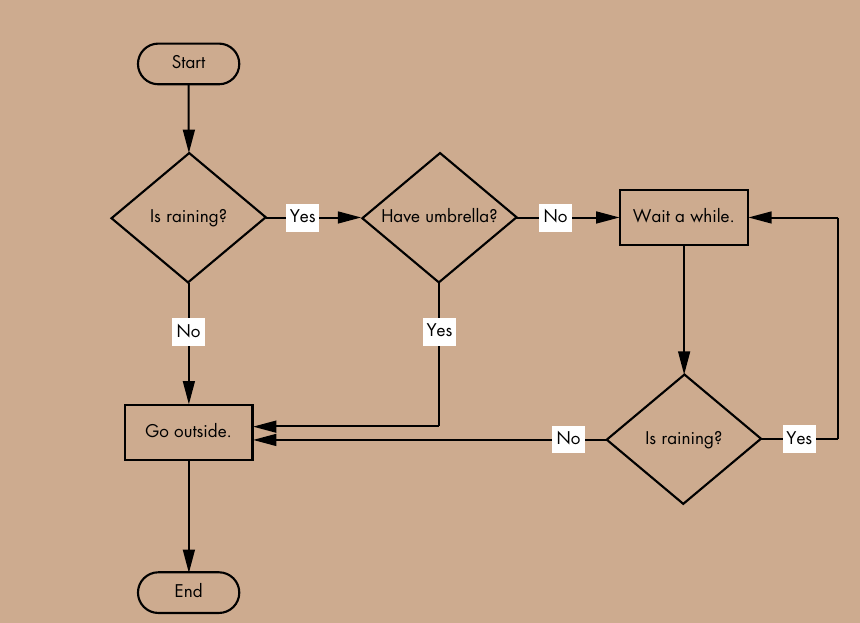
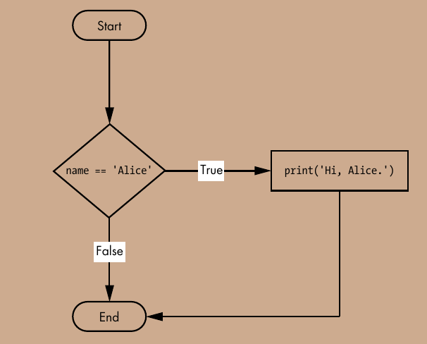
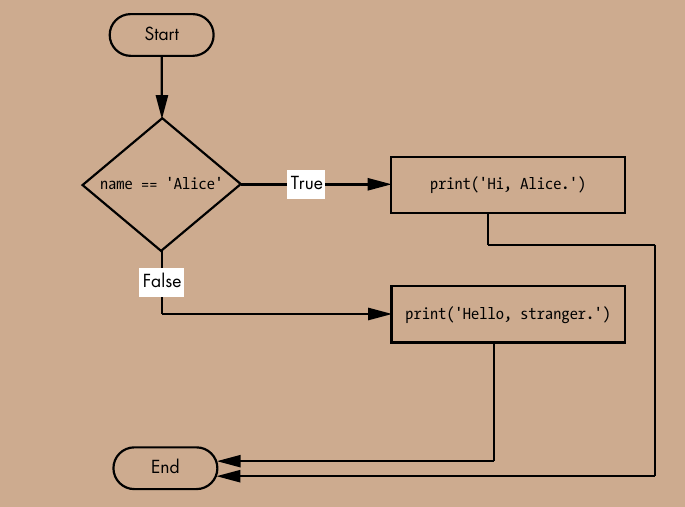
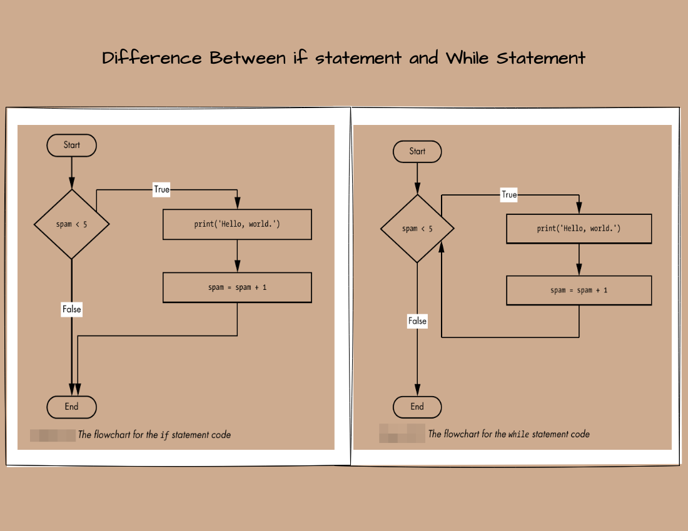
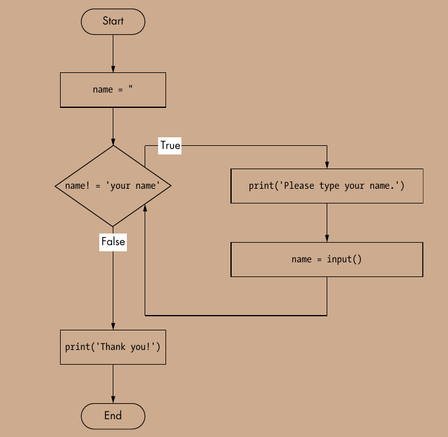
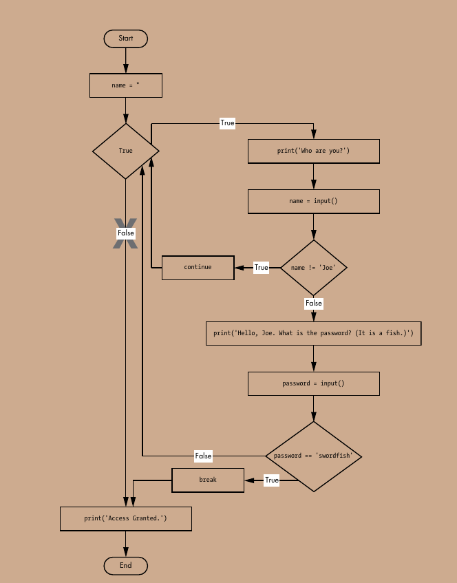

# Flow Control ( Conditional Braching `if...elif...else`)





- In a flowchart, there is usually more than one way to go from the start to the end.

- Diamonds ==> `branching point`
- starting and ending point ==> `round`
- other steps ==> `rectangle`


## Boolean Value

- Boolen has only two value `True` and `False`

- Boolean value can stored in variable

# Operators

## Comparison Operator

- compare two values and evaluate down to a single Boolean value

|operator		| Meaning	              |
|---------------|-------------------------|            
| `==`			| Equal to                |
| `!=`			| Not Equal to            |
| `<`			| Less than	              |
| `>`			| Greater than            |
| `<=`			| Less than or equal to   |
| `>=`			| Greater than or equal to| 


## Boolean Operator (`and`, `or`, `not`)

-The and and or operators always take two Boolean values (or expressions),so they’re considered binary operators.

## The `and` Operator Truth Table

| expressions	 | Evaluates to            |
|--------------- |-------------------------|            
| True and True	 | True                    |
| True and False | False                   |
| False and True | False                   |
| False and False| False                   |

## The `or` Operator's Truth Table

| expressions	 | Evaluates to            |
|--------------- |-------------------------|            
| True or True	 | True                    |
| True or False  | True                    |
| False or True  | True                    |
| False or  False| False                   |

## The `not` Operator Truth Table

| expressions	 | Evaluates to            |
|--------------- |-------------------------|            
| not True	 	 | False                   |
| not False  	 | True                    |

# Element of Flow Control

## Condition

- Condition always evalutat Boolean value, `True` or `False`

- . A flow control statement decides what to do based on whether its condition is True or False, and almost every flow control statement uses a condition

## Block of Code

- Python code grouped together in `blocks`.

- Three rules of block
	- Block begin when indentation increase
	- Block can contain other blocks
	- Block end when the indentation decreases to zero


# Flow Control Statements

## `if` Stagement

- “If this condition is true, execute the code in the clause

```
if name = 'Alice':
	print('Hi, Alice.')

```




## `else` statement

```
if name = 'Alice':
	print('Hi, Alice.')
else:
	print('Hello, Stranger')

```




## `elif` Statement

```
if name == 'Alice':
	print('Hi, Alice.')
elif name == 'Bob':
	print('Hi, Bob')
else:
	print('Hello, Stranger')
```

[example_program](../else_if.py)


# Loop

## While Loop

- excute a block of code over and over again with while statement

-  a while clause will be executed as long as the while state-
ment’s condition is True



```
name = ''
while name != 'your name':
	print('Please type your name.')
	name = input()
print('Thank you!')
```



[example_program](../your_name.py)


## `break` and `continue` Statement

- If the execution reaches a break statement, it immediately  exits the while loop’s clause

- When the program execution reaches a continue statement, the program execution immediately jumps back to the start of the loop and reevaluates the loop’s condition.

```
while True:
	print('Who are you?')
	name = input()
	if name != 'Joe':
 		continue
	print('Hello, Joe. What is the password? (It is a fish.)')
	password = input()
	if password == 'swordfish':
		break
print('Access granted.')
```



[example_program](../your_name2.py)


# For Loops and the `range()` Function

-The while loop keeps looping while its condition is `True`,  but what if you want to execute a block of code only a certain
number of times? You can do this with a for loop statement and the range() function.

```
total = 0
for num in range(101):
	total = total + num
print(total)
```

## Start, stop and step in `range()`

```
for i in range (0,12,2):
	print(i)
```

#### Countdown Example

```
for i in range (5,-1,-1):
	print(i)
```


## Printing list content

```
student_list=[('Alice',20),('Bob',30),('Leo',22)]

for student in student_list:
	print(student)
```


```
student_dictionary = { 'name' : ['Bob', 'Alice', 'Leo'], 
'age': [20,30,12], 
'gender' : ['male', 'female', 'male']}

for student in student_dictionary.value():
	print(student[1])

# Checking Key

for student in student_dictionary.key():
	print(student)
```

